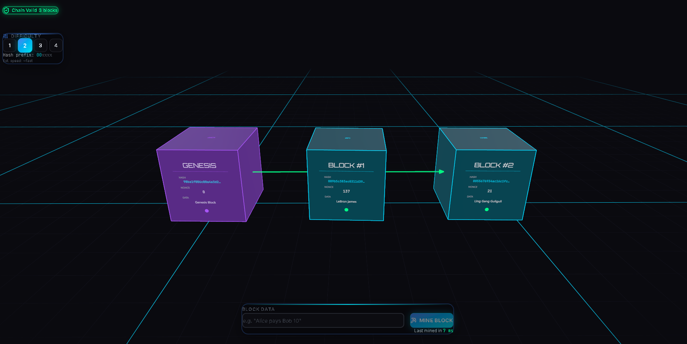
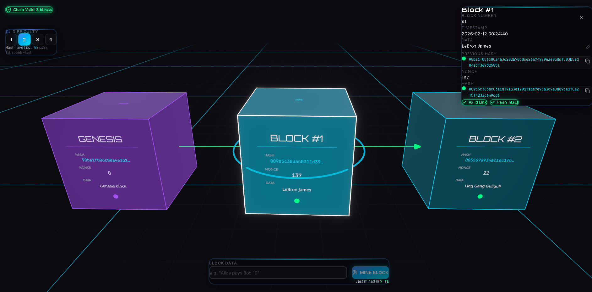
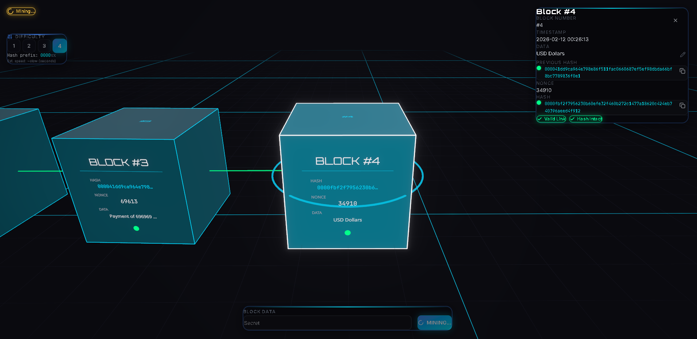
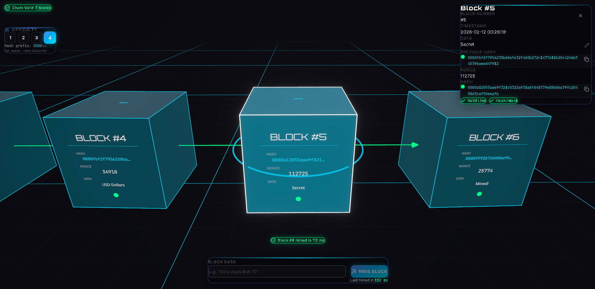
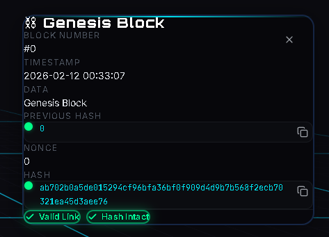
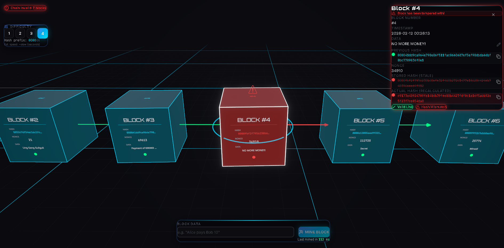
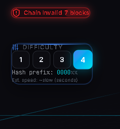

# ⛓️ Blockchain in 3D — by AJ

An interactive 3D blockchain visualizer that brings cryptographic concepts to life. Explore how blocks link through SHA-256 hashes, mine new blocks with proof-of-work, adjust difficulty in real time, and watch the chain break when data is tampered with — all rendered in a cinematic Tron-inspired 3D scene powered by Three.js.

🔗 **[Live Demo → blockchain.ajaparicio.com](https://blockchain.ajaparicio.com)**

---



---

## ✨ Features

| Feature                    | Description                                                                                                                                        |
| -------------------------- | -------------------------------------------------------------------------------------------------------------------------------------------------- |
| **3D Block Chain**         | Each block is a floating 3D card connected by glowing chain links. Navigate freely with orbit controls.                                            |
| **Mining (Proof-of-Work)** | Enter transaction data, hit Mine, and watch the nonce increment until the hash meets the difficulty target. Mining time is reported on completion. |
| **Live Validation**        | A persistent badge shows **Chain Valid ✅** or **Chain Invalid ❌**, updating instantly on every change.                                           |
| **Difficulty Selector**    | Choose difficulty 1–4 (number of leading zeros). Higher difficulty = harder mining.                                                                |
| **Tampering Demo**         | Edit any block's data without re-mining — the chain immediately turns invalid with visual red indicators on broken links.                          |
| **Post-Processing**        | Bloom, vignette, and environment reflections give the scene a polished, cinematic look.                                                            |

---

## 📸 Screenshots

### Chain Display — Blocks with all six required fields

> Block number · timestamp · data · previous hash · nonce · hash



### Mining in Progress

> Visual spinner and "Mining…" state while proof-of-work runs



### Mining Complete — Success Toast

> Reports mining time (e.g., "Mined in 45ms")



### Block Detail Panel

> Click any 3D block to inspect its full data in the side panel



### Tampering Demo — Chain Broken

> After editing a block's data, the chain turns invalid with red highlights



### Difficulty Selector

> Switch between difficulty 1–4



---

## 🛠️ Tech Stack

| Layer           | Technology                                      |
| --------------- | ----------------------------------------------- |
| Framework       | React 19                                        |
| Language        | TypeScript 5.9 (strict)                         |
| Bundler         | Vite 7                                          |
| 3D Engine       | Three.js via React Three Fiber + Drei           |
| Post-Processing | `@react-three/postprocessing` (Bloom, Vignette) |
| Hashing         | crypto-js (SHA-256)                             |
| Styling         | Tailwind CSS 4                                  |
| State           | Zustand                                         |
| Linting         | ESLint 9 + Prettier                             |
| Git Hooks       | Husky + lint-staged                             |

---

## 🚀 Getting Started

### Prerequisites

- **Node.js** ≥ 18
- **npm** ≥ 9 (or pnpm / yarn)

### Installation

```bash
git clone https://github.com/ajaparicio36/blockchain-visualizer.git
cd blockchain-visualizer
npm install
```

### Run Locally

```bash
npm run dev
```

Open [http://localhost:5173](http://localhost:5173) in your browser.

### Build for Production

```bash
npm run build
npm run preview
```

---

## 📂 Project Structure

```
src/
├── core/                  # Blockchain logic (no UI)
│   ├── Block.ts           # Block class — calculateHash(), mine()
│   └── Blockchain.ts      # Blockchain class — addBlock(), isValid()
├── store/
│   └── useBlockchainStore.ts  # Zustand store wrapping Blockchain
├── components/
│   ├── three/             # React Three Fiber 3D components
│   │   ├── Scene.tsx      # Canvas, camera, lights, post-processing
│   │   ├── BlockCard3D.tsx# Individual 3D block card
│   │   ├── ChainGroup.tsx # Renders all blocks + chain links
│   │   ├── ChainLinks3D.tsx # Glowing connections between blocks
│   │   ├── CameraRig.tsx  # Auto-follow camera
│   │   └── Lighting.tsx   # Multi-light rig (ambient, key, rim, accent)
│   ├── blockchain/        # 2D HUD overlay components
│   │   ├── AddBlockForm.tsx      # Mine input + button
│   │   ├── BlockDetailPanel.tsx  # Selected block inspector
│   │   ├── BlockEditor.tsx       # Inline edit for tampering demo
│   │   ├── DifficultySelector.tsx
│   │   └── ValidationBadge.tsx
│   └── ui/                # Reusable UI primitives (shadcn/ui)
├── types/                 # Shared TypeScript interfaces
├── utils/                 # Pure helpers (formatHash, etc.)
└── lib/                   # Utility functions (cn, etc.)
```

---

## 🎮 How to Use

1. **Navigate the scene** — Click and drag to orbit. Scroll to zoom. Right-click to pan.
2. **Mine a block** — Type transaction data (e.g., `Alice pays Bob 10`) in the bottom input and click **Mine Block**.
3. **Inspect a block** — Click any 3D block to open the detail panel on the right.
4. **Change difficulty** — Use the difficulty selector (top-left) to choose 1–4 leading zeros.
5. **Tamper with data** — In the detail panel, click the ✏️ edit icon on any block, change the data, and save. Watch the chain break instantly.

---

## 📜 License

This project was built as a course assignment. Feel free to explore, learn, and build upon it.
